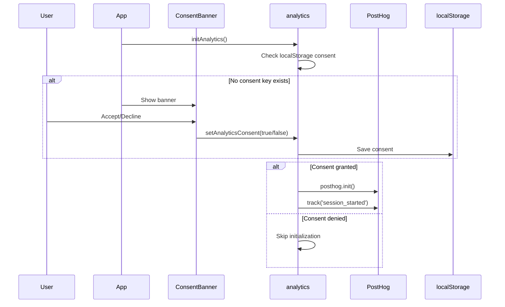

# PostHog Analytics Audit Report

**Date**: 2025-12-12  
**Auditor**: Antigravity AI  
**Project**: Magnus Component Testing

---

## Executive Summary

The Magnus application has a **comprehensive PostHog analytics implementation** with consent management, typed events, and good coverage across the application.

| Category | Score | Notes |
|----------|-------|-------|
| **Type Safety** | ⭐⭐⭐⭐⭐ | Excellent typed events |
| **Privacy Compliance** | ⭐⭐⭐⭐⭐ | Full consent management |
| **Event Coverage** | ⭐⭐⭐⭐ | 12 event types, good usage |
| **Integration Quality** | ⭐⭐⭐⭐ | Clean separation of concerns |
| **Documentation** | ⭐⭐⭐ | Inline comments, no README |

---

## 📁 File Inventory

### Core Analytics Files

| File | Purpose | Lines |
|------|---------|-------|
| [analytics.ts](file:///c:/Users/USER/Desktop/Magnus%20component%20testing/src/lib/analytics.ts) | Core analytics library | 316 |
| [ConsentBanner.tsx](file:///c:/Users/USER/Desktop/Magnus%20component%20testing/src/components/Analytics/ConsentBanner.tsx) | GDPR consent UI | 50 |
| [ConsentBanner.css](file:///c:/Users/USER/Desktop/Magnus%20component%20testing/src/components/Analytics/ConsentBanner.css) | Consent banner styles | 88 |

### Files Using Analytics

| File | Events Used |
|------|-------------|
| [main.tsx](file:///c:/Users/USER/Desktop/Magnus%20component%20testing/src/main.tsx) | `initAnalytics()` |
| [App.tsx](file:///c:/Users/USER/Desktop/Magnus%20component%20testing/src/App.tsx) | `<ConsentBanner />` |
| [useScrollTracking.ts](file:///c:/Users/USER/Desktop/Magnus%20component%20testing/src/hooks/useScrollTracking.ts) | `trackArticleCompleted` |
| [useShare.ts](file:///c:/Users/USER/Desktop/Magnus%20component%20testing/src/hooks/useShare.ts) | `trackArticleShared` |
| [useAiChat.ts](file:///c:/Users/USER/Desktop/Magnus%20component%20testing/src/hooks/useAiChat.ts) | `trackAiChatUsed` |
| [ShareModal.tsx](file:///c:/Users/USER/Desktop/Magnus%20component%20testing/src/components/ShareModal/ShareModal.tsx) | `trackArticleShared` |
| [AudioPlayer.tsx](file:///c:/Users/USER/Desktop/Magnus%20component%20testing/src/components/AudioPlayer/AudioPlayer.tsx) | `trackArticleCompleted` |
| ResumenHub pages | `trackArticleView`, `trackResumenFormatSelected` |
| NoticiasHub pages | `trackArticleView` |
| Epaper pages | `trackEpaperOpened`, `trackEpaperDateFiltered` |

---

## 🟢 Excellent: Event Type System

**File**: [analytics.ts](file:///c:/Users/USER/Desktop/Magnus%20component%20testing/src/lib/analytics.ts)

### Event Names (Discriminated Union)

```typescript
export type AnalyticsEventName =
    | 'article_viewed'
    | 'article_completed'
    | 'resumen_format_selected'
    | 'epaper_opened'
    | 'epaper_date_filtered'
    | 'ai_chat_used'
    | 'article_saved'
    | 'article_shared'
    | 'theme_changed'
    | 'font_size_changed'
    | 'session_started'
    | 'session_ended';
```

### Event Properties (Typed)

| Event | Properties Interface |
|-------|---------------------|
| `article_viewed` | `ArticleViewedProps` |
| `article_completed` | `ArticleViewedProps` |
| `resumen_format_selected` | `ResumenFormatSelectedProps` |
| `epaper_opened` | `EpaperOpenedProps` |
| `epaper_date_filtered` | `EpaperDateFilteredProps` |
| `ai_chat_used` | `AiChatUsedProps` |
| `article_saved` | `ArticleSavedProps` |
| `article_shared` | `ArticleSharedProps` |
| `theme_changed` | `ThemeChangedProps` |
| `font_size_changed` | `FontSizeChangedProps` |
| `session_started` | `SessionStartedProps` |
| `session_ended` | `SessionEndedProps` |

### Union Type Pattern

```typescript
export type AnalyticsEvent =
    | { name: 'article_viewed'; properties: ArticleViewedProps }
    | { name: 'article_completed'; properties: ArticleViewedProps }
    | { name: 'resumen_format_selected'; properties: ResumenFormatSelectedProps }
    // ... fully typed discriminated union
```

This pattern provides **compile-time safety** - you cannot call `track()` with mismatched event/properties.

---

## 🟢 Excellent: Privacy & Consent

### Consent Flow



### Consent API

| Function | Purpose |
|----------|---------|
| `setAnalyticsConsent(granted: boolean)` | Save consent, enable/disable |
| `getAnalyticsConsent(): boolean` | Check current consent |
| `hasConsentBeenSet(): boolean` | Check if user has chosen |

### PostHog Configuration (Privacy-First)

```typescript
posthog.init(POSTHOG_KEY, {
    api_host: POSTHOG_HOST,
    autocapture: false,        // No automatic tracking
    capture_pageview: false,   // Manual pageview only
    persistence: 'localStorage',
});
```

> [!TIP]
> Setting `autocapture: false` and `capture_pageview: false` ensures **strict privacy compliance** - only explicitly tracked events are sent.

---

## 🟢 Excellent: Consent Banner UI

**File**: [ConsentBanner.tsx](file:///c:/Users/USER/Desktop/Magnus%20component%20testing/src/components/Analytics/ConsentBanner.tsx)

### Features

| Feature | Status | Notes |
|---------|--------|-------|
| Auto-show on first visit | ✅ | Checks `hasConsentBeenSet()` |
| Clear messaging | ✅ | Spanish, explains data usage |
| Two-button choice | ✅ | "Aceptar" / "No, gracias" |
| Slide-up animation | ✅ | CSS keyframes |
| Responsive layout | ✅ | Stacked on mobile, row on desktop |
| High z-index | ✅ | z-index: 9999 |

### User-Facing Copy

```
¿Nos permites usar datos de uso anónimos para mejorar la experiencia en MAGNUS?

No recopilamos información personal como tu nombre o correo.
```

---

## 🟢 Good: Helper Functions

The library provides **convenience functions** for common tracking patterns:

```typescript
// Article tracking helpers
trackArticleView(articleId, section, format?, entryPoint?)
trackArticleCompleted(articleId, section, format?)
trackArticleSaved(articleId, section, format?)
trackArticleShared(articleId, section, format, platform)

// Feature tracking helpers
trackResumenFormatSelected(articleId, selectedFormat)
trackEpaperOpened(date, entryPoint)
trackEpaperDateFiltered(selectedDate)
trackAiChatUsed(context, queryLength)
```

These helpers wrap the core `track()` function with proper typing.

---

## 🟢 Good: Scroll Tracking Hook

**File**: [useScrollTracking.ts](file:///c:/Users/USER/Desktop/Magnus%20component%20testing/src/hooks/useScrollTracking.ts)

### Purpose
Track when user has read 80% of an article.

### Implementation

```typescript
export const useScrollTracking = (
    articleId: string | undefined,
    section: ArticleViewedProps['section'],
    format?: ArticleViewedProps['format']
) => {
    const hasFired = useRef(false);
    
    useEffect(() => {
        const handleScroll = () => {
            if (hasFired.current) return;
            
            const scrollY = window.scrollY;
            const windowHeight = window.innerHeight;
            const documentHeight = document.documentElement.scrollHeight;
            
            // Check if scrolled past 80%
            if (scrollY + windowHeight > documentHeight * 0.8) {
                trackArticleCompleted(articleId, section, format);
                hasFired.current = true;
            }
        };
        
        window.addEventListener('scroll', handleScroll);
        return () => window.removeEventListener('scroll', handleScroll);
    }, [articleId, section, format]);
};
```

### Strengths
- ✅ Uses ref to prevent duplicate events
- ✅ Resets on article change
- ✅ Initial check for short pages
- ✅ Cleanup on unmount

---

## 📊 Event Coverage Analysis

### Events Defined vs Used

| Event | Defined | Used In Code | Status |
|-------|---------|--------------|--------|
| `article_viewed` | ✅ | ✅ ResumenHub, NoticiasHub | ✅ Active |
| `article_completed` | ✅ | ✅ useScrollTracking, AudioPlayer | ✅ Active |
| `resumen_format_selected` | ✅ | ✅ ResumenArticleFormatsList | ✅ Active |
| `epaper_opened` | ✅ | ✅ EpaperEditionPage | ✅ Active |
| `epaper_date_filtered` | ✅ | ✅ EpaperHubPage | ✅ Active |
| `ai_chat_used` | ✅ | ✅ useAiChat | ✅ Active |
| `article_saved` | ✅ | ❌ | ⚠️ Unused |
| `article_shared` | ✅ | ✅ ShareModal, useShare | ✅ Active |
| `theme_changed` | ✅ | ❌ | ⚠️ Unused |
| `font_size_changed` | ✅ | ❌ | ⚠️ Unused |
| `session_started` | ✅ | ✅ initAnalytics | ✅ Active |
| `session_ended` | ✅ | ❌ | ⚠️ Unused |

### Missing Tracking

| Feature | Expected Event | Status |
|---------|----------------|--------|
| Theme toggle | `theme_changed` | ❌ Not tracked |
| Font size change | `font_size_changed` | ❌ Not tracked |
| Article save/bookmark | `article_saved` | ❌ Not tracked |
| Session end | `session_ended` | ❌ Not tracked |
| User identification | `setUserTraits` | ❌ Not used |

---

## 🟡 Observations & Issues

### 1. Unused Events

> [!WARNING]
> 4 event types are defined but never used:
> - `article_saved`
> - `theme_changed`
> - `font_size_changed`
> - `session_ended`

**Recommendation**: Either implement tracking where these features exist, or remove unused types to reduce maintenance burden.

---

### 2. User Traits Not Used

The `setUserTraits()` function is defined but never called:

```typescript
export function setUserTraits(traits: Partial<UserTraits>): void {
    // ... implementation exists
}

export interface UserTraits {
    user_id?: string;
    is_subscriber?: boolean;
    theme_preference?: 'light' | 'dark';
    font_size?: 'small' | 'medium' | 'large';
    device_type?: 'web' | 'android' | 'ios';
    app_version?: string;
}
```

**Recommendation**: Call `setUserTraits()` after login with user info for better analytics segmentation.

---

### 3. Session End Not Tracked

`session_ended` event exists but is never fired. Tracking session duration requires:

```typescript
// Before page unload or visibility change
window.addEventListener('beforeunload', () => {
    const duration = calculateSessionDuration();
    track({
        name: 'session_ended',
        properties: { duration_seconds: duration }
    });
});
```

**Recommendation**: Implement with `visibilitychange` API or `beforeunload`.

---

### 4. Placeholder API Key

```typescript
const POSTHOG_KEY = import.meta.env.VITE_POSTHOG_KEY || 'phc_PLACEHOLDER_KEY';
```

The fallback `'phc_PLACEHOLDER_KEY'` will cause PostHog to fail silently.

**Recommendation**: Add explicit error logging when key is missing:
```typescript
if (!import.meta.env.VITE_POSTHOG_KEY) {
    console.warn('[Analytics] VITE_POSTHOG_KEY not set, analytics disabled');
    return;
}
```

---

### 5. Dead Code Usage

Some events are tracked in **dead code files** (marked in DeadCodeAudit.md):

| File | Status | Events |
|------|--------|--------|
| `NoticiasArticlePage.tsx` | DEAD | `trackArticleView` |
| `NoticiasArticleFormatPage.tsx` | DEAD | `trackArticleView` |

These tracking calls will be removed when dead code is cleaned up.

---

## 📈 PostHog Dashboard Recommendations

### Suggested Dashboards

1. **Content Engagement**
   - Article views by section
   - Completion rate (viewed vs completed)
   - Format preference distribution

2. **Feature Usage**
   - AI chat queries per session
   - E-paper access patterns
   - Resumen format popularity

3. **User Behavior**
   - Share platform distribution
   - Entry point analysis
   - Session duration histogram

### Suggested Funnels

1. **Article Consumption Funnel**
   ```
   article_viewed → article_completed → article_shared
   ```

2. **Resumen Engagement**
   ```
   article_viewed (resumen) → resumen_format_selected → article_completed
   ```

---

## ✅ Implementation Best Practices

### What's Done Well

1. **Consent-First Architecture**
   - No tracking without explicit consent
   - Easy opt-out at any time
   - Clear user communication

2. **Type Safety**
   - Discriminated unions for events
   - TypeScript interfaces for all properties
   - Compile-time validation

3. **Separation of Concerns**
   - Core library in `lib/analytics.ts`
   - UI in `components/Analytics/`
   - Usage via imported functions

4. **No Autocapture**
   - Only explicit events tracked
   - No PII in automatic data
   - Clean data set

5. **Development Logging**
   ```typescript
   if (import.meta.env.DEV) {
       console.log('[Analytics] Tracked:', event.name, event.properties);
   }
   ```

---

## 🔧 Recommendations

### High Priority

1. **Implement missing event tracking**
   - Theme changes when user toggles
   - Font size changes in settings
   - Article save/bookmark feature

2. **Call setUserTraits after login**
   ```typescript
   // In AuthContext after successful login
   setUserTraits({
       user_id: user.id,
       is_subscriber: user.subscription?.active || false,
   });
   ```

3. **Add PostHog key validation**
   - Log warning when key is missing
   - Don't initialize with placeholder

### Medium Priority

4. **Track session end**
   - Use `visibilitychange` API
   - Calculate session duration

5. **Add page view tracking**
   - Track navigation between sections
   - Add to AppRouter

6. **Remove unused event types**
   - Or implement tracking for them

### Low Priority

7. **Add analytics documentation**
   - Create README for analytics
   - Document event taxonomy

8. **Add feature flags**
   - Use PostHog feature flags for A/B testing
   - `posthog.isFeatureEnabled('new_feature')`

---

## Environment Variables Required

```bash
# PostHog Configuration
VITE_POSTHOG_KEY=phc_your_project_key_here
VITE_POSTHOG_HOST=https://app.posthog.com
```

---

## Conclusion

The PostHog implementation is **well-architected** with excellent type safety and privacy compliance. The main areas for improvement are:

- ✅ Strong type system with discriminated unions
- ✅ Full consent management (GDPR-ready)
- ✅ Privacy-first configuration (no autocapture)
- ⚠️ 4 unused event types defined
- ⚠️ User traits not utilized
- ⚠️ Session end not tracked

**Overall Grade: A-**
