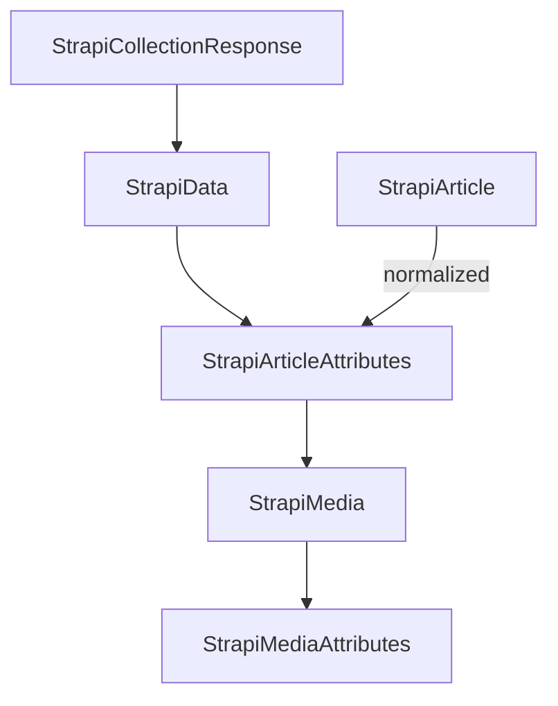
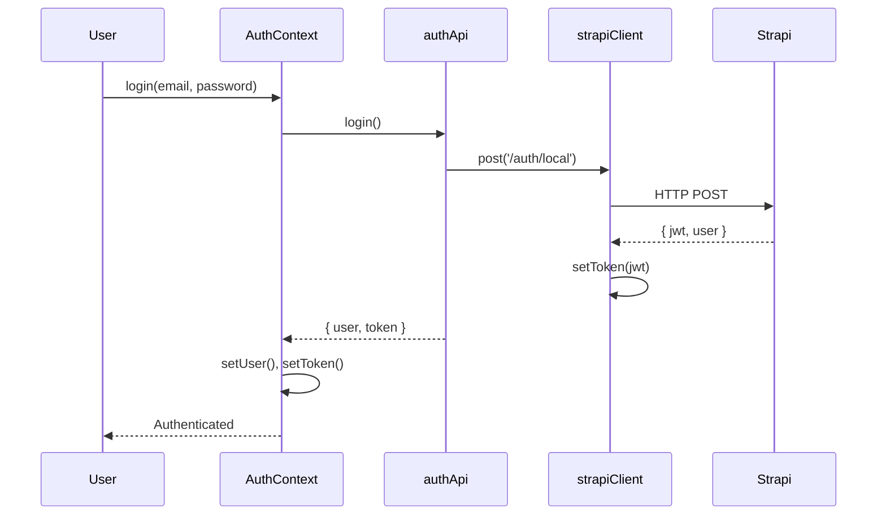
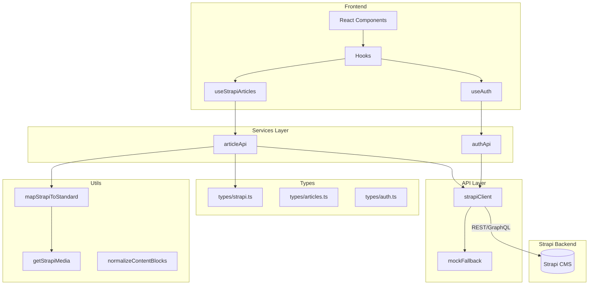

# Strapi Integration Audit Report

**Date**: 2025-12-12  
**Auditor**: Antigravity AI  
**Project**: Magnus Component Testing

---

## Executive Summary

The Magnus application has a **comprehensive Strapi integration** built on a class-based HTTP client with support for REST API, GraphQL, file uploads, and JWT authentication.

| Category | Score | Notes |
|----------|-------|-------|
| **API Client** | ⭐⭐⭐⭐⭐ | Excellent class-based design |
| **Type Safety** | ⭐⭐⭐⭐ | Good types, some `any` usage |
| **Data Normalization** | ⭐⭐⭐⭐ | Handles Strapi v4/v5 differences |
| **Authentication** | ⭐⭐⭐⭐⭐ | Complete JWT implementation |
| **Error Handling** | ⭐⭐⭐⭐ | Good with fallback support |
| **Environment Config** | ⭐⭐⭐⭐ | Multi-environment support |

---

## 📁 File Inventory

### Core Integration Files

| File | Purpose | Lines |
|------|---------|-------|
| [strapiClient.ts](file:///c:/Users/USER/Desktop/Magnus%20component%20testing/src/api/strapiClient.ts) | HTTP client class | 194 |
| [types/strapi.ts](file:///c:/Users/USER/Desktop/Magnus%20component%20testing/src/types/strapi.ts) | Type definitions | 231 |
| [lib/env.ts](file:///c:/Users/USER/Desktop/Magnus%20component%20testing/src/lib/env.ts) | Environment config | 60 |
| [services/articleApi.ts](file:///c:/Users/USER/Desktop/Magnus%20component%20testing/src/services/articleApi.ts) | Article API wrapper | 218 |
| [services/authApi.ts](file:///c:/Users/USER/Desktop/Magnus%20component%20testing/src/services/authApi.ts) | Auth API wrapper | 145 |
| [hooks/useStrapiArticles.ts](file:///c:/Users/USER/Desktop/Magnus%20component%20testing/src/hooks/useStrapiArticles.ts) | React data hooks | 133 |
| [context/AuthContext.tsx](file:///c:/Users/USER/Desktop/Magnus%20component%20testing/src/context/AuthContext.tsx) | Auth state management | 150 |

### Supporting Files

| File | Purpose | Lines |
|------|---------|-------|
| [utils/media.ts](file:///c:/Users/USER/Desktop/Magnus%20component%20testing/src/utils/media.ts) | Media URL helper | 25 |
| [utils/articleMapper.ts](file:///c:/Users/USER/Desktop/Magnus%20component%20testing/src/utils/articleMapper.ts) | Strapi to Standard mapper | 92 |
| [adapters/strapiAdapter.ts](file:///c:/Users/USER/Desktop/Magnus%20component%20testing/src/modules/articles/adapters/strapiAdapter.ts) | Legacy v4 adapter | 52 |
| [api/mockFallback.ts](file:///c:/Users/USER/Desktop/Magnus%20component%20testing/src/api/mockFallback.ts) | Mock data fallback | 19 |
| [StrapiTestPage.tsx](file:///c:/Users/USER/Desktop/Magnus%20component%20testing/src/modules/noticiasHub/pages/StrapiTestPage.tsx) | Dev testing page | 146 |

---

## 🟢 Excellent: StrapiClient Class

**File**: [strapiClient.ts](file:///c:/Users/USER/Desktop/Magnus%20component%20testing/src/api/strapiClient.ts)

### Features

| Feature | Status | Notes |
|---------|--------|-------|
| REST API | ✅ | get, getOne, post, put, delete |
| GraphQL | ✅ | graphql() method |
| File Upload | ✅ | upload() with FormData |
| JWT Auth | ✅ | setToken, clearToken, getToken |
| Token Persistence | ✅ | localStorage integration |
| Error Handling | ✅ | Strapi error format parsing |
| TypeScript | ✅ | Generic request<T> method |

### Architecture

```typescript
class StrapiClient {
    private baseUrl: string;
    private token?: string;

    // Token management
    setToken(token: string)
    clearToken()
    getToken(): string | undefined

    // HTTP methods
    private async request<T>(endpoint: string, options?: RequestInit): Promise<T>
    async get<T>(endpoint: string, params?: Record<string, string>): Promise<T>
    async getOne<T>(endpoint: string, id: string | number): Promise<T>
    async post<T>(endpoint: string, data?: unknown): Promise<T>
    async put<T>(endpoint: string, data?: unknown): Promise<T>
    async delete<T>(endpoint: string): Promise<T>

    // Advanced
    async graphql<T>(query: string, variables?: Record<string, any>): Promise<T>
    async upload(file: File): Promise<any>
}

export const strapiClient = new StrapiClient();
```

### Strengths

1. **Singleton Pattern** - Single instance exported for app-wide use
2. **Token Auto-Injection** - All requests include Bearer token if set
3. **Error Enhancement** - Spanish error messages for common Strapi errors
4. **GraphQL Support** - Full query/mutation support with variables

---

## 🟢 Excellent: Type System

**File**: [types/strapi.ts](file:///c:/Users/USER/Desktop/Magnus%20component%20testing/src/types/strapi.ts)

### Type Coverage

| Type | Purpose | Lines |
|------|---------|-------|
| `StrapiData<T>` | Generic data wrapper | 8-11 |
| `StrapiCollectionResponse<T>` | Paginated list response | 13-23 |
| `StrapiSingleResponse<T>` | Single item response | 25-28 |
| `StrapiMediaAttributes` | Media file attributes | 30-52 |
| `StrapiMediaFormat` | Image format variants | 54-64 |
| `StrapiArticleAttributes` | Raw article from API | 102-141 |
| `StrapiArticle` | Normalized frontend type | 144-230 |

### Type Hierarchy



### AI Content Types

The types include future AI-generated content:

```typescript
executive_summary?: {
    summary_text: string;
    bullet_points: any[];
    generated_at?: string;
    tokens_used?: number;
    ai_provider?: string;
    version?: string;
}

audio_summary?: {
    audio_file?: { url: string };
    duration_seconds?: number;
    voice?: string;
    transcript?: string;
}

video_summary?: { ... }
ppt_summary?: { ... }
infographic_summary?: { ... }
```

---

## 🟢 Excellent: Authentication Flow

**Files**: 
- [authApi.ts](file:///c:/Users/USER/Desktop/Magnus%20component%20testing/src/services/authApi.ts)
- [AuthContext.tsx](file:///c:/Users/USER/Desktop/Magnus%20component%20testing/src/context/AuthContext.tsx)

### Auth Features

| Feature | Status | Endpoint |
|---------|--------|----------|
| Login | ✅ | `/auth/local` |
| Register | ✅ | `/auth/local/register` |
| Current User | ✅ | `/users/me` |
| Social Login | ✅ | Token-based |
| Logout | ✅ | Client-side token clear |
| Mock Fallback | ✅ | Development mode |

### Auth Flow Diagram



### Token Management

```typescript
// Token stored in localStorage with key 'jwt'
const TOKEN_KEY = 'jwt';

// On app start, token is auto-loaded
const storedToken = localStorage.getItem('jwt');
if (storedToken) {
    this.token = storedToken;
}

// On login, token is persisted
strapiClient.setToken(response.jwt);
localStorage.setItem('jwt', token);
```

---

## 🟢 Good: Data Normalization

**File**: [articleApi.ts](file:///c:/Users/USER/Desktop/Magnus%20component%20testing/src/services/articleApi.ts)

### Strapi v4 vs v5 Handling

The `normalizeArticle` function handles both Strapi response formats:

```typescript
function normalizeArticle(data: any): StrapiArticle {
    // Strapi v5 - Data is flat, no "attributes" key
    // Strapi v4 - Data has { id, attributes: {...} }
    const attrs = data.attributes || data;
    const id = data.documentId || data.id?.toString();
    
    return {
        documentId: id,
        title: attrs.title || 'Untitled',
        // ... handle both formats
        hero_image: attrs.hero_image ? {
            url: attrs.hero_image.url || attrs.hero_image.data?.attributes?.url,
            // ...
        } : undefined,
    };
}
```

### Content Block Normalization

Handles dynamic zone components:

| Component | Strapi Key | Normalized Fields |
|-----------|------------|-------------------|
| Rich Text | `content.rich-text` | text |
| Quote | `content.quote` | quote, author |
| Single Image | `content.single-image` | image.url, caption |
| Gallery | `content.gallery` | images[] |
| Illustrations | `content.illustrations` | images[] |
| Infographics | `content.infographics` | images[] |

### Deep Population Query

```typescript
// getArticleBySlug uses deep population for all nested content
const params = new URLSearchParams({
    'populate[content_blocks][on][content.single-image][populate]': '*',
    'populate[content_blocks][on][content.gallery][populate]': '*',
    'populate[content_blocks][on][content.quote][populate]': '*',
    'populate[audio_summary][populate]': '*',
    'populate[hero_image][populate]': '*',
    'populate[author][populate]': '*',
    'populate[related_articles][populate][hero_image][populate]': '*',
    // ... etc
});
```

---

## 🟢 Good: Environment Configuration

**File**: [env.ts](file:///c:/Users/USER/Desktop/Magnus%20component%20testing/src/lib/env.ts)

### Environment Variables

| Variable | Purpose | Default |
|----------|---------|---------|
| `VITE_STRAPI_URL` | Strapi API URL | `http://localhost:1337/api` |
| `VITE_API_BASE_URL` | Alternative API URL | Falls back to STRAPI_URL |
| `VITE_STRAPI_TOKEN` | API Token | undefined |
| `VITE_ENVIRONMENT` | Environment name | `development` |
| `VITE_USE_MOCKS` | Enable mock fallback | `false` |

### Multi-Environment Support

```typescript
function validateEnv(): EnvVars {
    const VITE_ENVIRONMENT = import.meta.env.VITE_ENVIRONMENT || 'development';
    
    let strapiUrl = import.meta.env.VITE_API_BASE_URL || import.meta.env.VITE_STRAPI_URL;
    
    if (!strapiUrl) {
        if (VITE_ENVIRONMENT === 'development') {
            strapiUrl = 'http://localhost:1337/api';
        } else if (VITE_ENVIRONMENT === 'staging') {
            strapiUrl = 'https://magnus-staging-api.tudominio.com/api';
        } else {
            strapiUrl = 'http://localhost:1337/api'; // Production fallback
        }
    }
    
    return { VITE_STRAPI_URL: strapiUrl, /* ... */ };
}
```

### Media URL Helper

```typescript
// getStrapiMedia() handles both relative and absolute URLs
export function getStrapiMedia(url: string | null | undefined): string | null {
    if (url == null) return null;
    
    // Absolute URLs pass through
    if (url.startsWith("http") || url.startsWith("//")) {
        return url;
    }
    
    // Relative paths get Strapi origin prepended
    let strapiUrl = import.meta.env.VITE_STRAPI_URL || "http://localhost:1337";
    if (strapiUrl.endsWith('/api')) {
        strapiUrl = strapiUrl.slice(0, -4); // Remove /api for media
    }
    
    return `${strapiUrl}${url}`;
}
```

---

## 🟡 Observations & Issues

### 1. Duplicate Type Definitions

> [!WARNING]
> `StrapiArticle` is defined in **two places**:
> - `src/types/strapi.ts` (lines 144-230)
> - `src/hooks/useStrapiArticles.ts` (lines 4-80)

**Impact**: Type drift risk if one is updated without the other.

**Recommendation**: Use a single source of truth:
```typescript
// In useStrapiArticles.ts, import instead of redefine
import type { StrapiArticle } from '../types/strapi';
```

---

### 2. Legacy Adapter Still Present

**File**: [strapiAdapter.ts](file:///c:/Users/USER/Desktop/Magnus%20component%20testing/src/modules/articles/adapters/strapiAdapter.ts)

This appears to be a **Strapi v4-only adapter** that may conflict with the v5 support in `articleApi.ts`.

```typescript
// Only handles v4 format
export const adaptStrapiArticleToClient = (data: any): Article => {
    if (!data || !data.attributes) {
        // Returns error object if no attributes (which is fine for v4, but v5 is flat)
    }
    //...
}
```

**Recommendation**: Mark as dead code or consolidate with `normalizeArticle()`.

---

### 3. Hardcoded URLs in Test Page

**File**: [StrapiTestPage.tsx](file:///c:/Users/USER/Desktop/Magnus%20component%20testing/src/modules/noticiasHub/pages/StrapiTestPage.tsx)

```typescript
// Line 118 - Hardcoded localhost
src={`http://localhost:1337${article.hero_image.url}`}
```

**Recommendation**: Use `getStrapiMedia()` utility:
```typescript
import { getStrapiMedia } from '../../../utils/media';
// ...
src={getStrapiMedia(article.hero_image.url)}
```

---

### 4. Missing .env File

No `.env` or `.env.example` file found in the project root.

**Recommendation**: Create `.env.example`:
```bash
# Strapi Configuration
VITE_STRAPI_URL=http://localhost:1337/api
VITE_STRAPI_TOKEN=
VITE_ENVIRONMENT=development

# Mock Data (development only)
VITE_USE_MOCKS=false

# Analytics (optional)
VITE_POSTHOG_KEY=
VITE_POSTHOG_HOST=
```

---

### 5. Any Types in Content Blocks

Several places use `any` for content blocks:

```typescript
// types/articles.ts line 40
contentBlocks: Array<any>;

// types/strapi.ts line 171
blocks?: any[];

// types/strapi.ts lines 126, 197
bullet_points: any[];
```

**Recommendation**: Define proper union types for dynamic zones:
```typescript
type ContentBlock = 
    | RichTextBlock
    | QuoteBlock
    | ImageBlock
    | GalleryBlock
    | AudioBlock
    | EmbedBlock;
```

---

## 📊 Integration Map



---

## 🔧 Recommendations

### High Priority

1. **Consolidate StrapiArticle type** - Remove duplicate from useStrapiArticles.ts
2. **Add .env.example** - Document required environment variables
3. **Fix hardcoded URLs** - Use getStrapiMedia() consistently

### Medium Priority

4. **Type content blocks properly** - Create union type for dynamic zones
5. **Mark strapiAdapter.ts as deprecated** - It only supports v4 format
6. **Add request caching** - Implement SWR or React Query for data fetching

### Low Priority

7. **Add GraphQL query types** - Currently using any for variables
8. **Add retry logic** - For transient network failures
9. **Add request interceptors** - For logging/debugging

---

## ✅ Setup Checklist

To run Magnus with Strapi:

1. **Start Strapi**
   ```bash
   cd strapi
   npm run develop
   ```

2. **Configure Environment** (create `.env`)
   ```bash
   VITE_STRAPI_URL=http://localhost:1337/api
   VITE_ENVIRONMENT=development
   ```

3. **Start Magnus**
   ```bash
   npm run dev
   ```

4. **Test Integration**
   - Navigate to `/dev/strapi-test`
   - Click "Run Data Setup" to seed test data

---

## Conclusion

The Strapi integration is **well-architected** with a clean separation of concerns:

- ✅ Class-based HTTP client with full REST/GraphQL/Upload support
- ✅ Comprehensive type definitions for Strapi v4/v5
- ✅ Complete authentication flow with token persistence
- ✅ Data normalization handling both API versions
- ✅ Mock fallback for development without Strapi

**Main areas for improvement**:
- Consolidate duplicate type definitions
- Add proper typing for dynamic zones
- Create environment variable documentation

**Overall Grade: A-**
